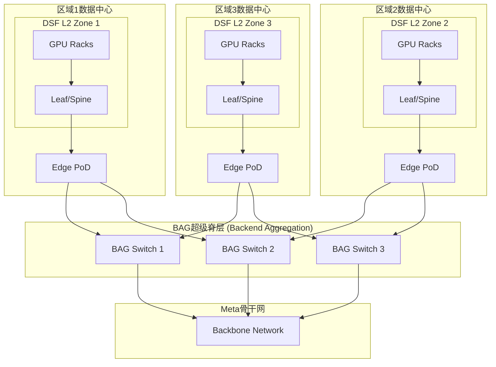

# BAG架构拓扑图

## 图片说明

此图展示了BAG（Backend Aggregation）架构如何实现跨区域的超大规模GPU集群互联：

**DSF L2 Zone**：
- 每个数据中心区域包含一个DSF L2网络
- 通过Leaf-Spine架构互联数千GPU

**Edge PoD**：
- 每个区域的出口聚合点
- 通过多链路连接到BAG层

**BAG超级脊层**：
- 集中式的以太网超级汇聚层
- 互联多个区域的Edge PoD
- 支持Petabit级带宽（16-48 Pbps）

**跨区域流量**：
- 不同区域的GPU可以通过BAG层通信
- 形成统一的超大规模计算资源池
- 支持吉瓦级AI训练基础设施

## 关键特性

1. **超配比设计**：BAG-to-BAG可根据需求配置4.5:1或4.98:1超配比
2. **平面拓扑选择**：支持Planar（平面）和Spread（分布式）两种拓扑
3. **路由协议**：使用eBGP + UCMP（不等价多路径）
4. **安全性**：BAG-to-BAG连接采用MACsec加密
