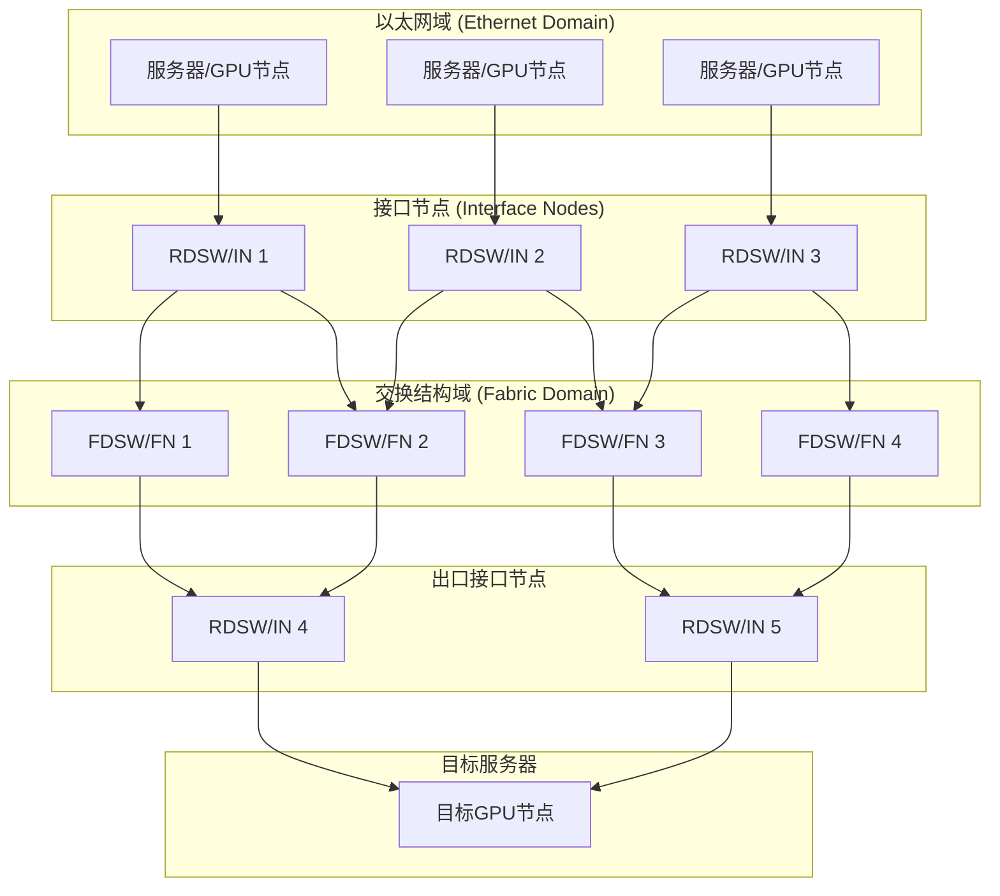

# DSF双域架构图

## 图片说明

此图展示了DSF（Disaggregated Scheduled Fabric）的双域架构：

**左侧 - 以太网域**：
- 服务器/GPU节点通过标准以太网连接到接口节点（IN/RDSW）
- 使用传统以太网协议进行通信

**中间 - 接口节点**：
- 负责外部连接和路由功能
- 将数据包分割为信元（Cells）

**中间 - 交换结构域**：
- 由多个交换节点（FN/FDSW）组成
- 通过包喷洒技术将信元均匀分布到所有路径
- 实现近最优的负载均衡

**右侧 - 出口接口节点**：
- 接收来自结构域的信元
- 重新组装数据包并按序交付

这种架构的优势：
1. 突破传统机箱式交换机的物理限制
2. 实现细粒度的负载均衡
3. 支持超大规模扩展（万卡/十万卡集群）
