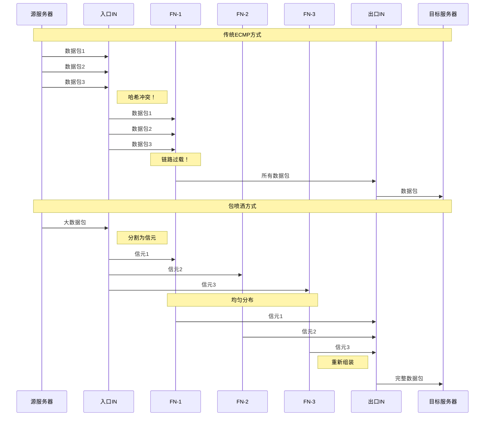

# 包喷洒（Packet Spraying）技术示意图



## 图片说明

此图对比了传统ECMP和包喷洒两种负载均衡技术：

**上方 - 传统ECMP方式的问题**：
- 多个数据包通过哈希计算后被分配到同一条路径
- 导致某些链路过载，其他链路空闲
- 在AI训练的低熵流量场景下问题尤其严重

**下方 - 包喷洒方式的优势**：
1. **信元化**: 大数据包在入口被分割为固定大小的信元（Cells）
2. **均匀喷洒**: 信元被均匀分布到所有可用路径
3. **并行传输**: 多个信元同时通过不同路径传输
4. **重新组装**: 在出口处按序重组为原始数据包

## 关键技术组件

### 虚拟输出队列（VOQ）
```
入口IN:
┌─────────────────────────────────────┐
│  VOQ-1 │  VOQ-2 │  VOQ-3 │ ... │ VOQ-N │
├─────────────────────────────────────┤
│ 目标1  │ 目标2  │ 目标3  │ ... │ 目标N  │
└─────────────────────────────────────┘
```
- 每个目标端口维护独立的虚拟队列
- 避免队首阻塞（HOL Blocking）
- 独立调度，互不干扰

### 信用机制
```
入口IN ──请求信用──→ 出口IN
   ↑                  │
   └────授予信用─────┘
```
- 基于信用的流量控制
- 防止网络拥塞
- 确保无损传输

## 性能提升

| 指标 | ECMP | 包喷洒 | 提升 |
|------|------|--------|------|
| 链路利用率 | 40-60% | 85-95% | 2x |
| 负载均衡度 | 差 | 优 | - |
| 适应性 | 静态 | 动态 | - |
| 大象流处理 | 差 | 优 | - |
