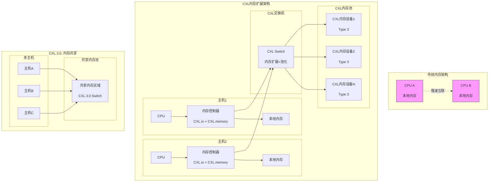

# CXL内存扩展架构图

## 图片说明

此图展示了CXL（Compute Express Link）技术如何实现内存扩展和池化：

**上方 - 传统内存架构**：
- 每个CPU只能访问自己的本地内存
- CPU之间通过慢速互联（如PCIe）访问远程内存
- 内存利用率低，存在大量" stranded memory "

**中间 - CXL内存扩展架构**：
- **CXL.io**: 兼容PCIe协议，用于设备发现和配置
- **CXL.memory**: 提供缓存一致性内存访问
- **CXL交换机**: 连接多个主机和CXL内存设备
- **内存池化**: 多个主机共享CXL内存池

**下方 - CXL 3.0内存共享**：
- 多主机可同时访问共享内存区域
- 支持缓存一致性（Cache Coherence）
- 适用于AI训练、内存数据库等场景

## CXL技术优势

| 特性 | PCIe | CXL 1.1 | CXL 2.0 | CXL 3.0 |
|------|------|---------|---------|---------|
| 内存扩展 | ❌ | ✅ | ✅ | ✅ |
| 内存池化 | ❌ | ❌ | ✅ | ✅ |
| 内存共享 | ❌ | ❌ | ❌ | ✅ |
| 带宽 | 64GB/s | 64GB/s | 64GB/s | 128GB/s+ |
| 延迟 | ~1μs | ~200ns | ~200ns | ~200ns |

## 应用场景

1. **AI训练**: 扩展GPU内存容量，减少数据搬运
2. **内存数据库**: 超大内存容量支持
3. **云计算**: 内存资源池化，提高利用率
4. **高性能计算**: 共享内存编程模型
