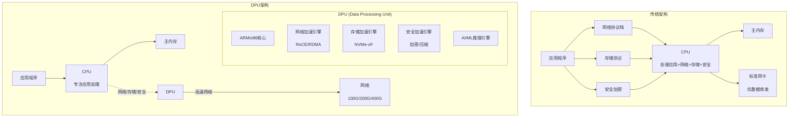

# DPU架构示意图

## 图片说明

此图对比了传统架构与DPU架构的区别：

**左侧 - 传统架构**：
- CPU需要处理应用程序、网络协议栈、存储协议和安全加密
- 大量CPU资源被基础设施任务占用（可达30-50%）
- 标准网卡功能简单，仅负责数据收发

**右侧 - DPU架构**：
- **CPU**：专注应用处理，性能提升显著
- **DPU**：专门处理基础设施任务
  - ARM/x86核心：运行网络/存储/安全软件
  - 网络加速引擎：支持RoCE/RDMA、网络虚拟化
  - 存储加速引擎：支持NVMe-oF、纠删码计算
  - 安全加速引擎：SSL/TLS加密、压缩解压缩
  - AI/ML推理引擎：卸载AI推理任务

## DPU的价值

| 指标 | 传统架构 | DPU架构 | 改进 |
|------|----------|---------|------|
| CPU利用率 | 70-80% | 40-50% | -30% |
| 网络延迟 | 高 | 低 | 10-50μs |
| 存储性能 | 受限 | 大幅提升 | 2-5x |
| 安全性 | 软件加密 | 硬件加速 | 10x+ |

## 主要厂商

- **NVIDIA**: BlueField-3 DPU
- **Intel**: Infrastructure Processing Unit (IPU)
- **AMD**: Pensando DSC
- **Marvell**: OCTEON DPUs
- **Broadcom**: Stingray PS
