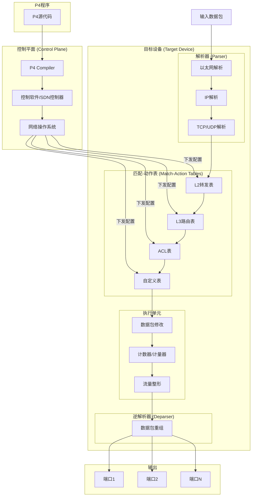

# P4可编程数据平面架构图

## 图片说明

此图展示了P4（Programming Protocol-independent Packet Processors）可编程数据平面的架构：

**上层 - P4开发流程**：
1. 开发者编写P4源代码定义数据包处理逻辑
2. P4编译器将代码编译为特定目标设备的配置
3. 控制软件/SDN控制器将配置下发到数据平面

**中层 - 数据平面流水线**：
1. **解析器**：逐层解析数据包头部（以太网→IP→TCP/UDP）
2. **匹配-动作表**：根据头部字段进行匹配并执行相应动作
3. **执行单元**：修改数据包、更新计数器、进行流量整形
4. **逆解析器**：将处理后的头部和数据重组为输出数据包

**下层 - 输出**：
- 根据处理结果将数据包转发到相应端口

## P4的优势

1. **协议无关**：不限定支持特定协议，可自定义新协议
2. **硬件无关**：同一份P4代码可编译到不同硬件平台
3. **可重构**：无需更换硬件即可改变数据包处理逻辑
4. **快速创新**：新功能开发周期从数月缩短到数天
