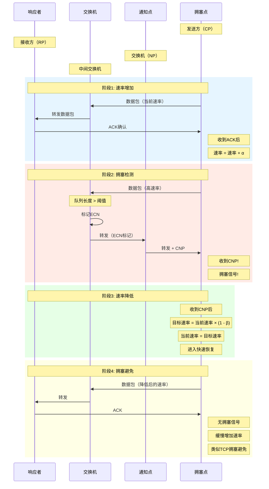

# DCQCN拥塞控制流程图

## 图片说明

此图展示了DCQCN（Datacenter Quantized Congestion Notification）拥塞控制算法的四个阶段：

### 阶段1: 速率增加
- 发送方（CP）正常发送数据
- 收到接收方（RP）的ACK后增加发送速率
- 类似TCP的慢启动阶段

### 阶段2: 拥塞检测
- 当交换机队列超过阈值时，标记ECN（Explicit Congestion Notification）
- 交换机作为通知点（NP）生成CNP（Congestion Notification Packet）
- CNP直接发送给发送方，通知网络拥塞

### 阶段3: 速率降低
- 发送方收到CNP后立即降低目标速率
- 当前速率快速下降到目标速率
- 进入快速恢复模式

### 阶段4: 拥塞避免
- 发送方以较低的速率继续发送
- 如果没有收到新的CNP，缓慢增加速率
- 维持稳定的吞吐量

## DCQCN参数

| 参数 | 符号 | 说明 |
|------|------|------|
| 速率增加因子 | α | 每个时间间隔的速率增量 |
| 速率减少因子 | β | 收到CNP时的速率减少比例 |
| ECN阈值 | K | 触发ECN标记的队列长度 |
| 字节计数器 | - | 控制速率更新的频率 |

## DCQCN vs TCP拥塞控制

| 特性 | TCP | DCQCN |
|------|-----|-------|
| 拥塞信号 | 丢包/延迟 | ECN/CNP |
| 响应速度 | 慢（RTT级别） | 快（微秒级） |
| 适用范围 | 通用网络 | 数据中心RDMA |
| 无损性 | 不保证 | 保证（配合PFC） |
| 复杂度 | 低 | 中等 |
