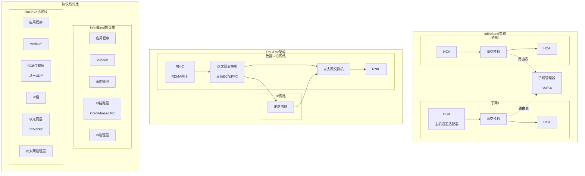

# RoCEv2 vs InfiniBand对比图

## 图片说明

此图对比了InfiniBand和RoCEv2两种RDMA技术的架构差异：

**左侧 - InfiniBand架构**：
- **专用网络**: 独立的交换机和线缆基础设施
- **子网管理器**: 集中式路由管理和网络配置
- **HCA**: 专用主机通道适配器
- **优势**: 极致性能、无损传输、简化管理

**右侧 - RoCEv2架构**：
- **标准以太网**: 利用现有数据中心网络基础设施
- **IP路由**: 可跨越子网，支持更大规模部署
- **RNIC**: 标准以太网RDMA网卡
- **优势**: 成本更低、兼容性更好、可扩展性更强

**下方 - 协议栈对比**：
- **InfiniBand**: 专用协议栈，从应用到物理层一体化设计
- **RoCEv2**: 在标准UDP/IP/以太网上实现RDMA，需要ECN/PFC支持无损传输

## 技术对比

| 特性 | InfiniBand | RoCEv2 |
|------|------------|--------|
| **网络类型** | 专用网络 | 标准以太网 |
| **延迟** | 极低 (~600ns) | 低 (~1μs) |
| **带宽** | 400G/800G | 100G/200G/400G |
| **成本** | 高 | 较低 |
| **兼容性** | 专用设备 | 通用以太网设备 |
| **可扩展性** | 子网内 | 跨子网/IP路由 |
| **拥塞控制** | Credit-based | ECN/PFC + DCQCN |
| **部署难度** | 需要专业团队 | 可利用现有团队 |

## 选择建议

**选择InfiniBand的场景**：
- 极致性能要求的HPC应用
- 封闭的高性能计算集群
- 有专业网络运维团队

**选择RoCEv2的场景**：
- 大规模AI训练集群
- 需要与现有以太网融合
- 成本敏感的项目
- 超大规模部署（跨数据中心）
