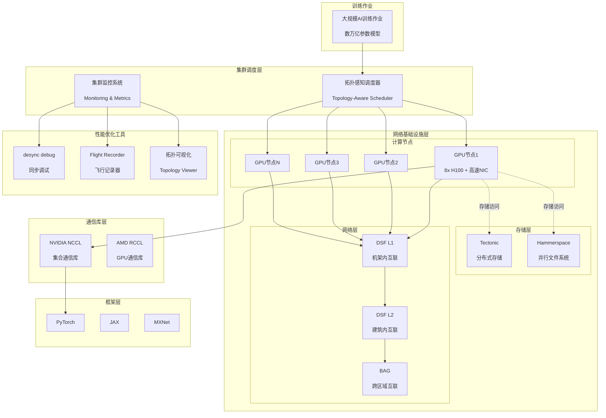

# AI训练集群网络架构全景图

## 图片说明

此图展示了大规模AI训练集群的完整网络架构栈：

### 从上到下的层次结构

**1. 训练作业层**：
- 大规模AI训练作业（数万亿参数模型）
- 分解为多个并行任务

**2. 集群调度层**：
- **拓扑感知调度器**：将通信频繁的GPU分配到物理邻近位置
- **集群监控系统**：实时监控性能和健康状态

**3. 网络基础设施层**：
- **计算节点**：配备8x H100 GPU和高速NIC的服务器
- **存储层**：Tectonic分布式存储 + Hammerspace并行文件系统
- **网络层**：DSF L1/L2 + BAG三层架构

**4. 通信库层**：
- NVIDIA NCCL：GPU间高效集合通信
- AMD RCCL：支持AMD GPU的通信库

**5. 框架层**：
- PyTorch、JAX、MXNet等深度学习框架

**6. 性能优化工具层**：
- **desync debug**：检测同步点性能异常
- **Flight Recorder**：记录集合通信历史状态
- **Topology Viewer**：可视化网络拓扑和流量

## 关键优化点

| 层级 | 优化技术 | 效果 |
|------|----------|------|
| 调度 | 拓扑感知调度 | 减少跨机架流量 |
| 网络 | DSF包喷洒 | 85-95%链路利用率 |
| 存储 | Tectonic检查点 | 数百毫秒完成 |
| 通信 | NCCL优化 | 90%+带宽利用率 |
| 调试 | desync debug | 快速定位问题 |

## 性能指标

- **规模**：18,000+ GPU互联
- **带宽**：每个GPU 400Gbps/800Gbps
- **延迟**：微秒级RDMA通信
- **利用率**：优化后90%+ vs 原始10-90%波动
