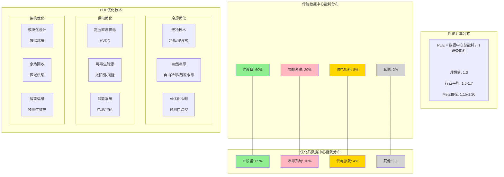

# 数据中心PUE优化示意图

## 图片说明

此图展示了数据中心PUE（Power Usage Effectiveness）的优化路径：

### PUE计算公式
- **PUE = 数据中心总能耗 / IT设备能耗**
- 理想值为1.0（意味着所有能耗都用于IT设备）
- 行业平均水平为1.5-1.7
- Meta的目标是1.15-1.20

### 能耗分布对比

**传统数据中心**：
- IT设备: 60%
- 冷却系统: 30%
- 供电损耗: 8%
- 其他: 2%

**优化后数据中心**：
- IT设备: 85% ⬆️
- 冷却系统: 10% ⬇️
- 供电损耗: 4% ⬇️
- 其他: 1% ⬇️

### 优化技术分类

**1. 冷却优化**：
- 液冷技术（冷板式/浸没式）
- 自然冷却（自由冷却/蒸发冷却）
- AI优化冷却（预测性温控）

**2. 供电优化**：
- 高压直流供电（HVDC）
- 可再生能源（太阳能/风能）
- 储能系统（电池/飞轮）

**3. 架构优化**：
- 模块化设计（按需部署）
- 余热回收（区域供暖）
- 智能运维（预测性维护）

## Meta的PUE优化成果

| 数据中心 | 传统PUE | 优化后PUE | 主要技术 |
|----------|---------|-----------|----------|
| Prineville | 1.60 | 1.15 | 蒸发冷却 |
| Luleå | 1.50 | 1.10 | 自然冷却 |
| Clonee | 1.55 | 1.12 | 自由冷却 |
| Singapore | 1.70 | 1.25 | 液冷+再生水 |
