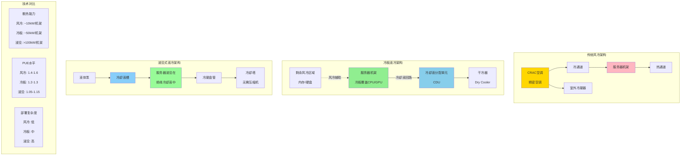

# 液冷技术架构对比图

## 图片说明

此图对比了三种数据中心冷却技术的架构：

### 传统风冷架构
- **原理**：空调产生冷空气，通过冷通道进入机架，热空气从热通道返回
- **组件**：精密空调（CRAC）、室外冷凝器、风道系统
- **局限**：散热密度有限（~10kW/机架），PUE较高

### 冷板液冷架构
- **原理**：冷却液直接接触CPU/GPU等高发热部件的金属冷板
- **组件**：
  - 冷板（Cold Plate）：覆盖在芯片上
  - CDU（Coolant Distribution Unit）：分配冷却液
  - 干冷器：室外散热
- **优势**：散热密度高（~50kW/机架），PUE降低至1.2-1.3
- **适用**：当前主流AI服务器冷却方案

### 浸没式液冷架构
- **原理**：服务器完全浸没在绝缘冷却液中
- **组件**：
  - 冷却液槽：容纳服务器和冷却液
  - 冷凝盘管：冷却液蒸发后在盘管冷凝
  - 冷却塔：无需压缩机的散热
- **优势**：
  - 散热密度极高（>100kW/机架）
  - PUE可低至1.05-1.15
  - 无风扇，噪音极低
  - 服务器可在更高温度下运行

## 冷却技术选择

| 场景 | 推荐方案 |
|------|----------|
| 传统云计算 | 风冷 |
| AI训练（H100/A100） | 冷板液冷 |
| 超算/高密度AI | 浸没式液冷 |
| 边缘计算 | 风冷或自然冷却 |

## Meta的液冷实践

- **部署规模**：数十MW的液冷容量
- **冷却液**：使用低毒性、环保型冷却液
- **PUE成果**：液冷数据中心PUE降至1.15以下
- **未来规划**：新建AI数据中心全面采用液冷
