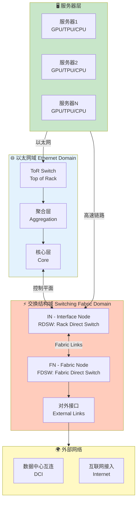
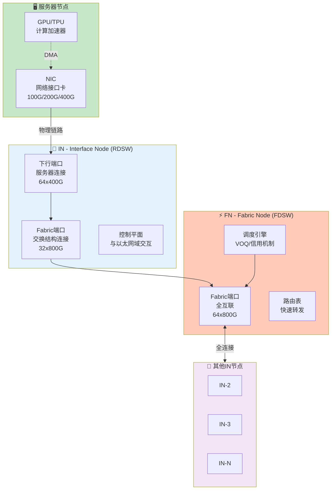
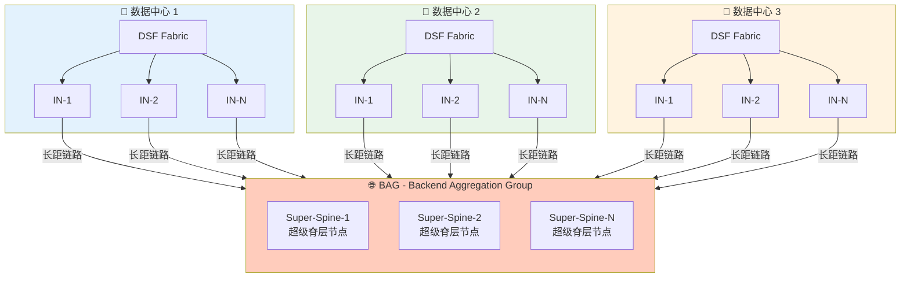
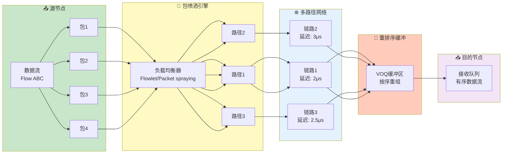

# 第3章 - DSF/BAG架构配图

## 3.1 DSF双域架构图

### 图片说明
展示DSF（Disaggregated Scheduled Fabric）的双域架构设计，包括以太网域（Ethernet Domain）和交换结构域（Switching Fabric Domain）的分层结构和互联关系。

### Mermaid图表代码


### LaTeX引用代码
```latex
\begin{figure}[htbp]
    \centering
    \includegraphics[width=0.95\textwidth]{chapter3/dsf-dual-domain.png}
    \caption{DSF双域架构示意图。以太网域提供传统网络服务，交换结构域提供超低延迟的调度 fabric，两者协同工作。}
    \label{fig:dsf-dual-domain}
\end{figure}
```

---

## 3.2 DSF组件图

### 图片说明
详细展示DSF架构中的核心组件：接口节点IN（Interface Node，使用RDSW）和Fabric节点FN（Fabric Node，使用FDSW）之间的互联关系和数据流向。

### Mermaid图表代码


### LaTeX引用代码
```latex
\begin{figure}[htbp]
    \centering
    \includegraphics[width=0.95\textwidth]{chapter3/dsf-components.png}
    \caption{DSF核心组件架构。IN（RDSW）负责服务器接入，FN（FDSW）负责高速交换，通过VOQ调度实现无阻塞传输。}
    \label{fig:dsf-components}
\end{figure}
```

---

## 3.3 BAG架构拓扑图

### 图片说明
展示BAG（Backend Aggregation Group）架构的跨区域互联设计，包括超级脊层（Super-Spine）如何连接多个数据中心的DSF fabric。

### Mermaid图表代码


### LaTeX引用代码
```latex
\begin{figure}[htbp]
    \centering
    \includegraphics[width=0.95\textwidth]{chapter3/bag-topology.png}
    \caption{BAG跨区域互联架构。多个数据中心的DSF通过BAG超级脊层互联，形成大规模AI训练网络。}
    \label{fig:bag-topology}
\end{figure}
```

---

## 3.4 包喷洒示意图

### 图片说明
展示DSF架构中的包喷洒（Packet Spraying）技术，包括数据包如何在多条路径上分布传输以实现负载均衡。

### Mermaid图表代码


### LaTeX引用代码
```latex
\begin{figure}[htbp]
    \centering
    \includegraphics[width=0.95\textwidth]{chapter3/packet-spraying.png}
    \caption{包喷洒技术示意图。通过将数据流分散到多条路径传输，提高网络利用率和避免拥塞，接收端通过VOQ缓冲区重排序。}
    \label{fig:packet-spraying}
\end{figure}
```

---

## 本章配图清单

| 序号 | 图号 | 图名 | 文件路径 |
|------|------|------|----------|
| 3.1 | Fig 3.1 | DSF双域架构示意图 | chapter3/dsf-dual-domain.png |
| 3.2 | Fig 3.2 | DSF核心组件架构 | chapter3/dsf-components.png |
| 3.3 | Fig 3.3 | BAG跨区域互联架构 | chapter3/bag-topology.png |
| 3.4 | Fig 3.4 | 包喷洒技术示意图 | chapter3/packet-spraying.png |
