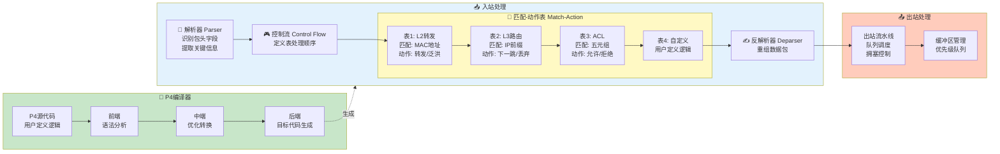
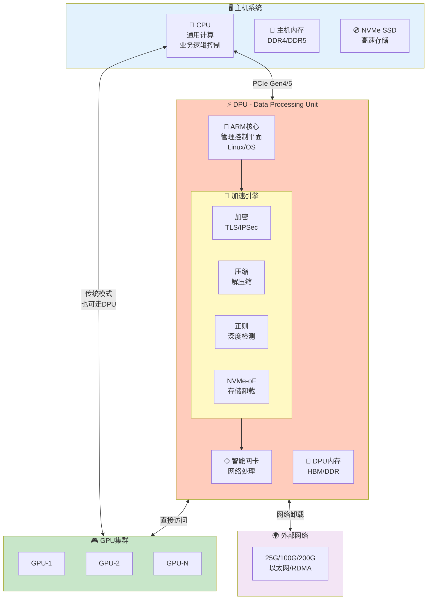
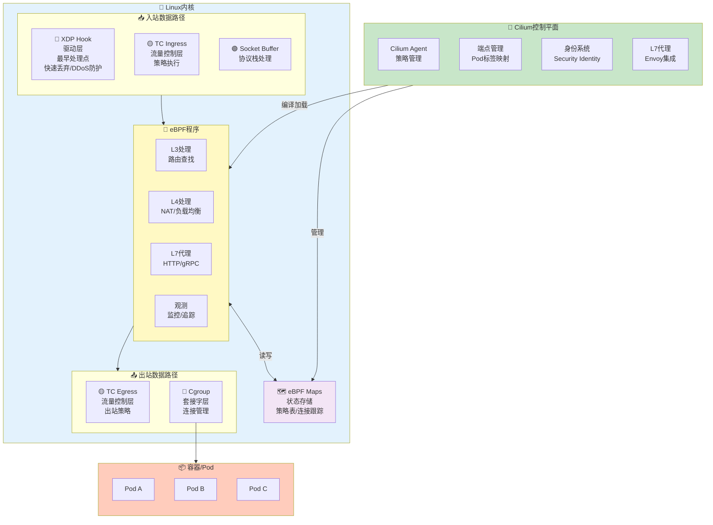

```mermaid
flowchart TB
    subgraph ROOT["🔲 根复合体 Root Complex"]
        direction TB
        HOST_CPU["Host CPU<br/>处理器和本地内存"]
        CXL_CTRL["CXL控制器<br/>协议转换"]
    end
    
    subgraph CXL_SWITCH["🔄 CXL交换机"]
        direction TB
        SW_PORTS["多端口交换<br/>内存一致性保证"]
    end
    
    subgraph TYPE1["💾 CXL Type 1 - 缓存设备"]
        direction TB
        T1_NIC["智能网卡/加速器<br/>带缓存<br/>CXL.cache协议"]
    end
    
    subgraph TYPE2["🎮 CXL Type 2 - 内存加速器"]
        direction TB
        T2_GPU["GPU/FPGA<br/>自有内存<br/>CXL.cache + CXL.memory"]
    end
    
    subgraph TYPE3["📦 CXL Type 3 - 内存扩展"]
        direction TB
        T3_MEM["内存扩展卡<br/>纯内存设备<br/>CXL.memory协议"]
        MEM_POOL["内存池化<br/>动态分配"]
    end
    
    subgraph PROTOCOLS["📋 CXL协议栈"]
        direction TB
        IO["CXL.io<br/>IO协议兼容PCIe"]
        CACHE["CXL.cache<br/>缓存一致性"]
        MEM["CXL.memory<br/>内存访问"]
    end
    
    HOST_CPU --> CXL_CTRL
    CXL_CTRL -->|PCIe物理层| CXL_SWITCH
    CXL_SWITCH --> TYPE1
    CXL_SWITCH --> TYPE2
    CXL_SWITCH --> TYPE3
    TYPE3 --> MEM_POOL
    
    style ROOT fill:#e3f2fd
    style CXL_SWITCH fill:#fff9c4
    style TYPE1 fill:#c8e6c9
    style TYPE2 fill:#ffccbc
    style TYPE3 fill:#f3e5f5
    style PROTOCOLS fill:#e1f5fe
```

# 第4章 - P4/DPU/CXL配图

## 4.1 P4可编程数据平面架构图

### 图片说明
展示P4（Programming Protocol-independent Packet Processors）语言定义的编程数据平面架构，包括解析器、匹配-动作表、控制流和反解析器等核心组件。

### Mermaid图表代码


### LaTeX引用代码
```latex
\begin{figure}[htbp]
    \centering
    \includegraphics[width=0.95\textwidth]{chapter4/p4-programmable-plane.png}
    \caption{P4可编程数据平面架构。通过P4语言定义数据包处理逻辑，编译后部署到可编程交换机或智能网卡。}
    \label{fig:p4-architecture}
\end{figure}
```

---

## 4.2 DPU架构示意图

### 图片说明
展示DPU（Data Processing Unit）的架构设计，以及CPU、DPU、GPU之间的协作关系，体现"卸载-加速-隔离"的设计理念。

### Mermaid图表代码


### LaTeX引用代码
```latex
\begin{figure}[htbp]
    \centering
    \includegraphics[width=0.95\textwidth]{chapter4/dpu-architecture.png}
    \caption{DPU架构与异构计算协作。DPU承担网络、存储、安全等基础设施任务，释放CPU和GPU专注于业务计算。}
    \label{fig:dpu-architecture}
\end{figure}
```

---

## 4.3 CXL内存扩展架构图

### 图片说明
展示CXL（Compute Express Link）技术如何实现内存扩展和池化，包括CXL三种协议类型（CXL.io、CXL.cache、CXL.memory）的应用场景。

### Mermaid图表代码


### LaTeX引用代码
```latex
\begin{figure}[htbp]
    \centering
    \includegraphics[width=0.95\textwidth]{chapter4/cxl-memory-expansion.png}
    \caption{CXL内存扩展架构。通过CXL协议实现内存池化、设备缓存一致性和异构内存扩展，突破单节点内存限制。}
    \label{fig:cxl-architecture}
\end{figure}
```

---

## 4.4 eBPF+Cilium数据路径图

### 图片说明
展示eBPF（Extended Berkeley Packet Filter）和Cilium如何实现高性能的容器网络安全和可观测性，包括数据路径和关键hook点。

### Mermaid图表代码


### LaTeX引用代码
```latex
\begin{figure}[htbp]
    \centering
    \includegraphics[width=0.95\textwidth]{chapter4/ebpf-cilium-datapath.png}
    \caption{eBPF+Cilium数据路径架构。利用eBPF在内核关键路径插入自定义逻辑，实现高性能的网络策略执行和可观测性。}
    \label{fig:ebpf-cilium}
\end{figure}
```

---

## 本章配图清单

| 序号 | 图号 | 图名 | 文件路径 |
|------|------|------|----------|
| 4.1 | Fig 4.1 | P4可编程数据平面架构 | chapter4/p4-programmable-plane.png |
| 4.2 | Fig 4.2 | DPU架构与异构计算协作 | chapter4/dpu-architecture.png |
| 4.3 | Fig 4.3 | CXL内存扩展架构 | chapter4/cxl-memory-expansion.png |
| 4.4 | Fig 4.4 | eBPF+Cilium数据路径 | chapter4/ebpf-cilium-datapath.png |
