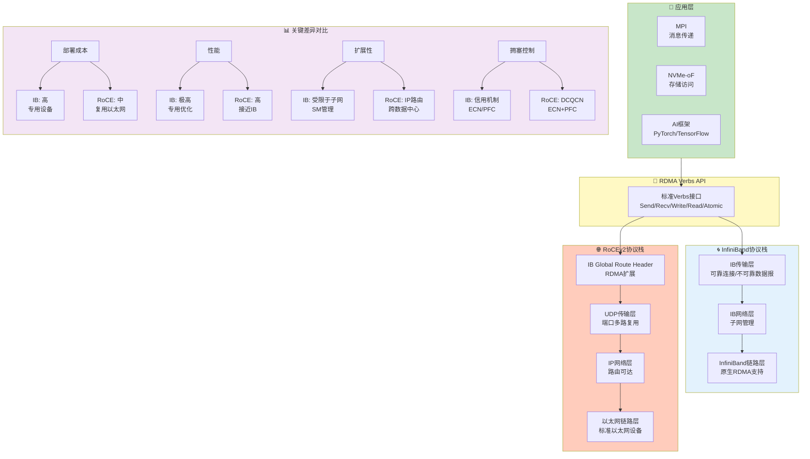
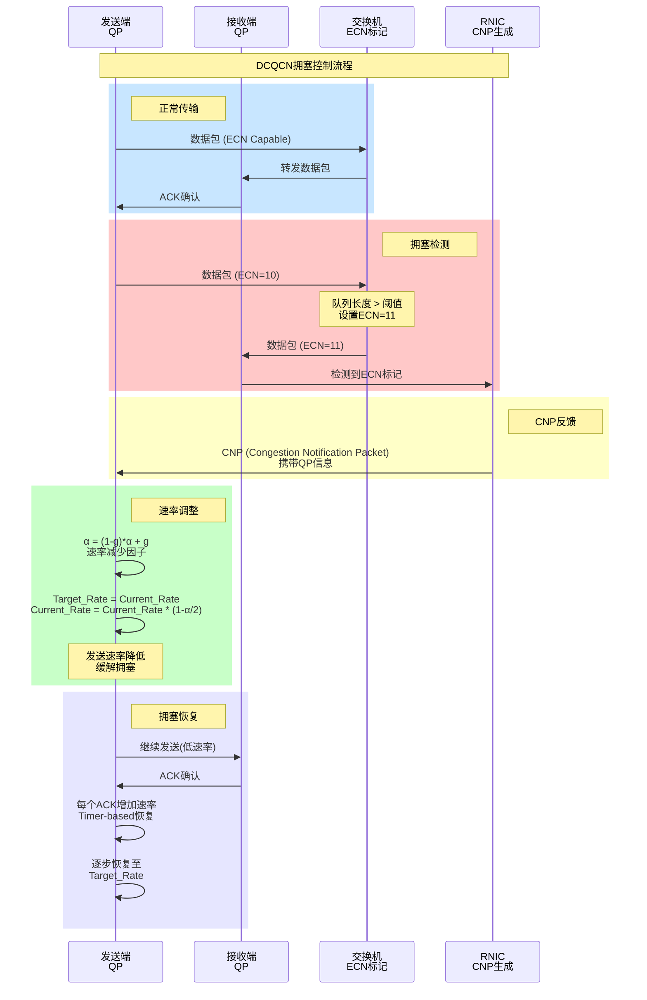
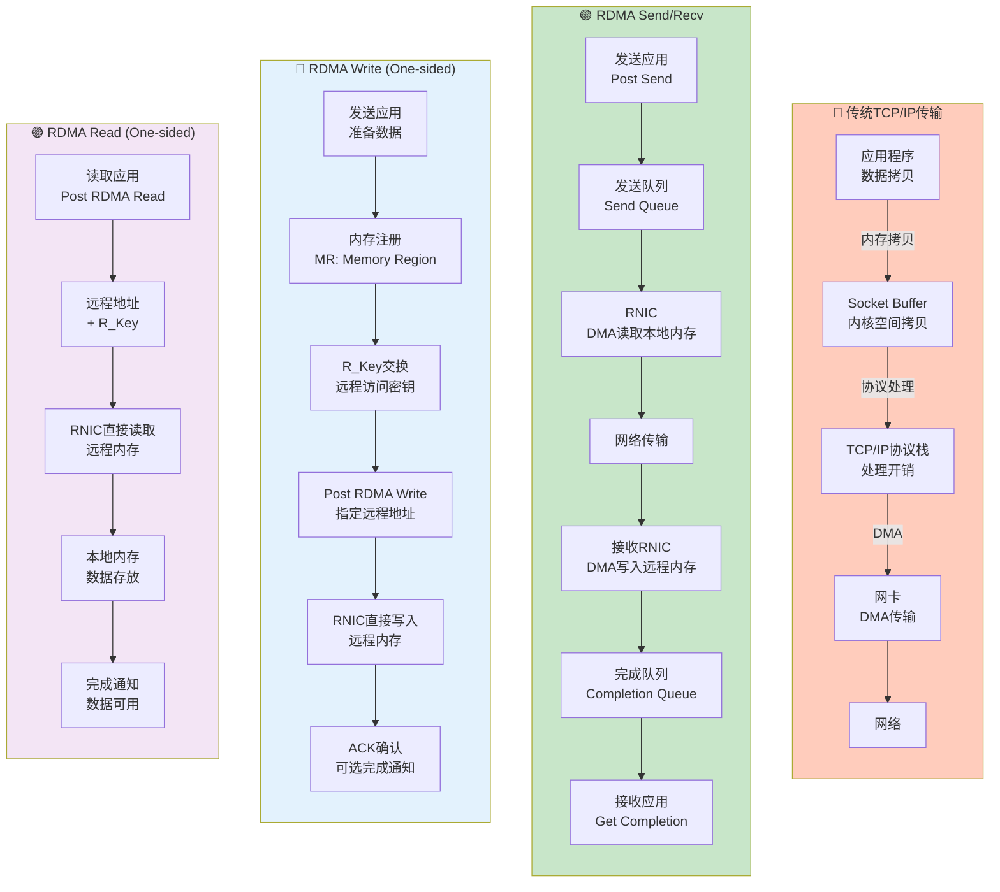
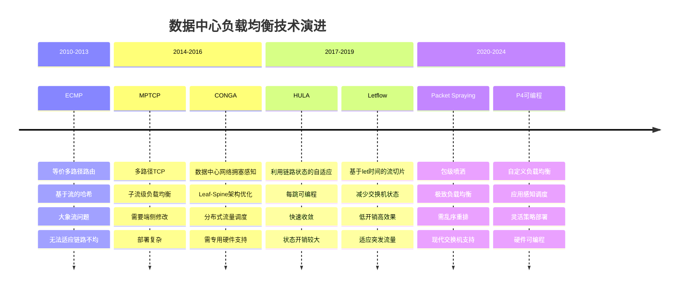

# 第5章 - RoCEv2/RDMA配图

## 5.1 RoCEv2 vs InfiniBand对比图

### 图片说明
对比展示RoCEv2（RDMA over Converged Ethernet v2）和InfiniBand两种RDMA技术在协议栈、部署方式和适用场景上的差异。

### Mermaid图表代码


### LaTeX引用代码
```latex
\begin{figure}[htbp]
    \centering
    \includegraphics[width=0.95\textwidth]{chapter5/rocev2-vs-infiniband.png}
    \caption{RoCEv2与InfiniBand协议栈对比。两者共享Verbs API，但在网络层实现上有差异，RoCEv2更适合大规模数据中心部署。}
    \label{fig:roce-vs-ib}
\end{figure}
```

---

## 5.2 DCQCN拥塞控制流程图

### 图片说明
展示DCQCN（Data Center Quantized Congestion Notification）拥塞控制算法的工作流程，包括CNP（Congestion Notification Packet）的生成和传播机制。

### Mermaid图表代码


### LaTeX引用代码
```latex
\begin{figure}[htbp]
    \centering
    \includegraphics[width=0.95\textwidth]{chapter5/dcqcn-congestion-control.png}
    \caption{DCQCN拥塞控制流程。交换机通过ECN标记拥塞，接收端生成CNP通知发送端，发送端采用量化的速率调整算法降低发送速率。}
    \label{fig:dcqcn-flow}
\end{figure}
```

---

## 5.3 RDMA数据传输路径图

### 图片说明
展示RDMA（Remote Direct Memory Access）的三种传输操作（Send/Recv、Write、Read）的数据路径，以及与传统TCP/IP的对比。

### Mermaid图表代码


### LaTeX引用代码
```latex
\begin{figure}[htbp]
    \centering
    \includegraphics[width=0.95\textwidth]{chapter5/rdma-data-path.png}
    \caption{RDMA数据传输路径对比。传统TCP/IP需要多次内存拷贝和内核介入，RDMA通过内核旁路实现零拷贝传输，大幅降低延迟和CPU开销。}
    \label{fig:rdma-path}
\end{figure}
```

---

## 5.4 负载均衡技术演进图

### 图片说明
展示数据中心网络负载均衡技术的演进历程，从传统的ECMP到现代的Packet Spraying、Conga、Letflow等技术。

### Mermaid图表代码


### LaTeX引用代码
```latex
\begin{figure}[htbp]
    \centering
    \includegraphics[width=0.95\textwidth]{chapter5/load-balancing-evolution.png}
    \caption{数据中心负载均衡技术演进时间线。从基于流的ECMP到包级喷洒，负载均衡粒度不断细化，适应AI训练等大带宽需求场景。}
    \label{fig:lb-evolution}
\end{figure}
```

---

## 本章配图清单

| 序号 | 图号 | 图名 | 文件路径 |
|------|------|------|----------|
| 5.1 | Fig 5.1 | RoCEv2与InfiniBand对比 | chapter5/rocev2-vs-infiniband.png |
| 5.2 | Fig 5.2 | DCQCN拥塞控制流程 | chapter5/dcqcn-congestion-control.png |
| 5.3 | Fig 5.3 | RDMA数据传输路径 | chapter5/rdma-data-path.png |
| 5.4 | Fig 5.4 | 负载均衡技术演进 | chapter5/load-balancing-evolution.png |
