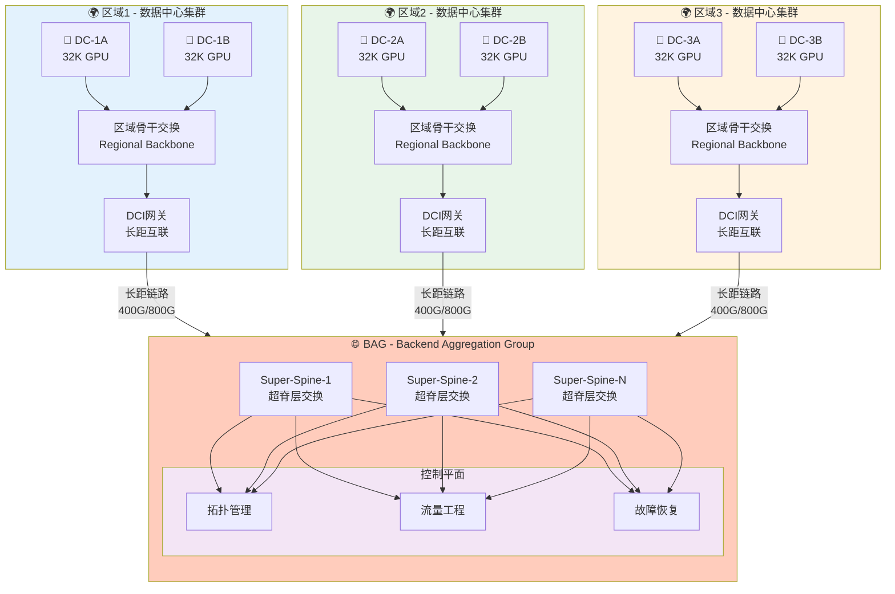
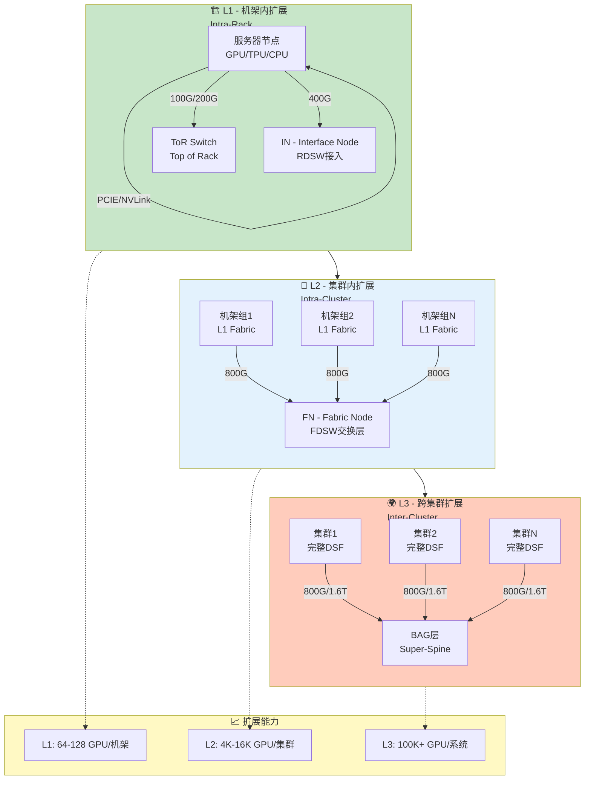
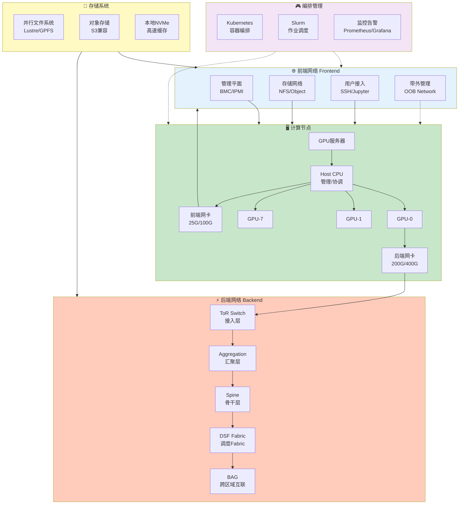
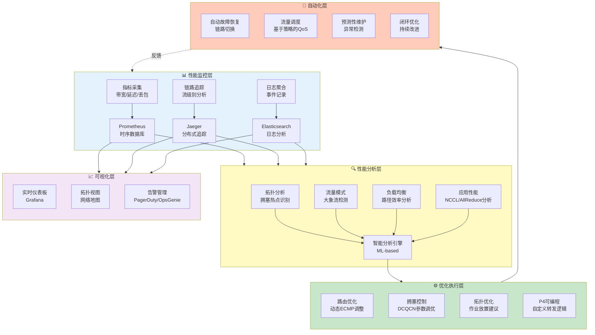

# 第6章 - AI训练网络配图

## 6.1 BAG跨区域互联拓扑图

### 图片说明
展示BAG（Backend Aggregation Group）架构如何实现多个地理分布的数据中心互联，支持大规模分布式AI训练。

### Mermaid图表代码


### LaTeX引用代码
```latex
\begin{figure}[htbp]
    \centering
    \includegraphics[width=0.95\textwidth]{chapter6/bag-interconnect.png}
    \caption{BAG跨区域互联拓扑。通过BAG超级脊层连接多个区域的数据中心，实现跨地域的大规模AI训练集群。}
    \label{fig:bag-interconnect}
\end{figure}
```

---

## 6.2 DSF三级扩展架构图

### 图片说明
展示DSF（Disaggregated Scheduled Fabric）的三级扩展架构：L1（机架内）、L2（集群内）、L3（跨集群）。

### Mermaid图表代码


### LaTeX引用代码
```latex
\begin{figure}[htbp]
    \centering
    \includegraphics[width=0.95\textwidth]{chapter6/dsf-three-tier.png}
    \caption{DSF三级扩展架构。L1实现机架内高速互联，L2实现集群内全连接，L3通过BAG实现跨集群扩展，支持百万级GPU规模。}
    \label{fig:dsf-tiers}
\end{figure}
```

---

## 6.3 AI训练集群网络架构全景图

### 图片说明
展示大规模AI训练集群的完整网络架构，包括前端网络（管理/存储）、后端网络（训练/计算）、以及各种网络平面之间的关系。

### Mermaid图表代码


### LaTeX引用代码
```latex
\begin{figure}[htbp]
    \centering
    \includegraphics[width=0.95\textwidth]{chapter6/ai-cluster-overview.png}
    \caption{AI训练集群网络架构全景。前端网络负责管理和存储，后端网络负责训练计算，通过分离设计实现最佳性能。}
    \label{fig:ai-cluster-overview}
\end{figure}
```

---

## 6.4 性能优化工具链图

### 图片说明
展示AI训练网络性能优化的完整工具链，包括性能监控、分析、调优和自动化优化的各个环节。

### Mermaid图表代码


### LaTeX引用代码
```latex
\begin{figure}[htbp]
    \centering
    \includegraphics[width=0.95\textwidth]{chapter6/performance-toolchain.png}
    \caption{AI训练网络性能优化工具链。从指标采集到智能分析，再到自动化优化，形成完整的闭环性能管理系统。}
    \label{fig:perf-toolchain}
\end{figure}
```

---

## 本章配图清单

| 序号 | 图号 | 图名 | 文件路径 |
|------|------|------|----------|
| 6.1 | Fig 6.1 | BAG跨区域互联拓扑 | chapter6/bag-interconnect.png |
| 6.2 | Fig 6.2 | DSF三级扩展架构 | chapter6/dsf-three-tier.png |
| 6.3 | Fig 6.3 | AI训练集群网络架构全景 | chapter6/ai-cluster-overview.png |
| 6.4 | Fig 6.4 | 性能优化工具链 | chapter6/performance-toolchain.png |
