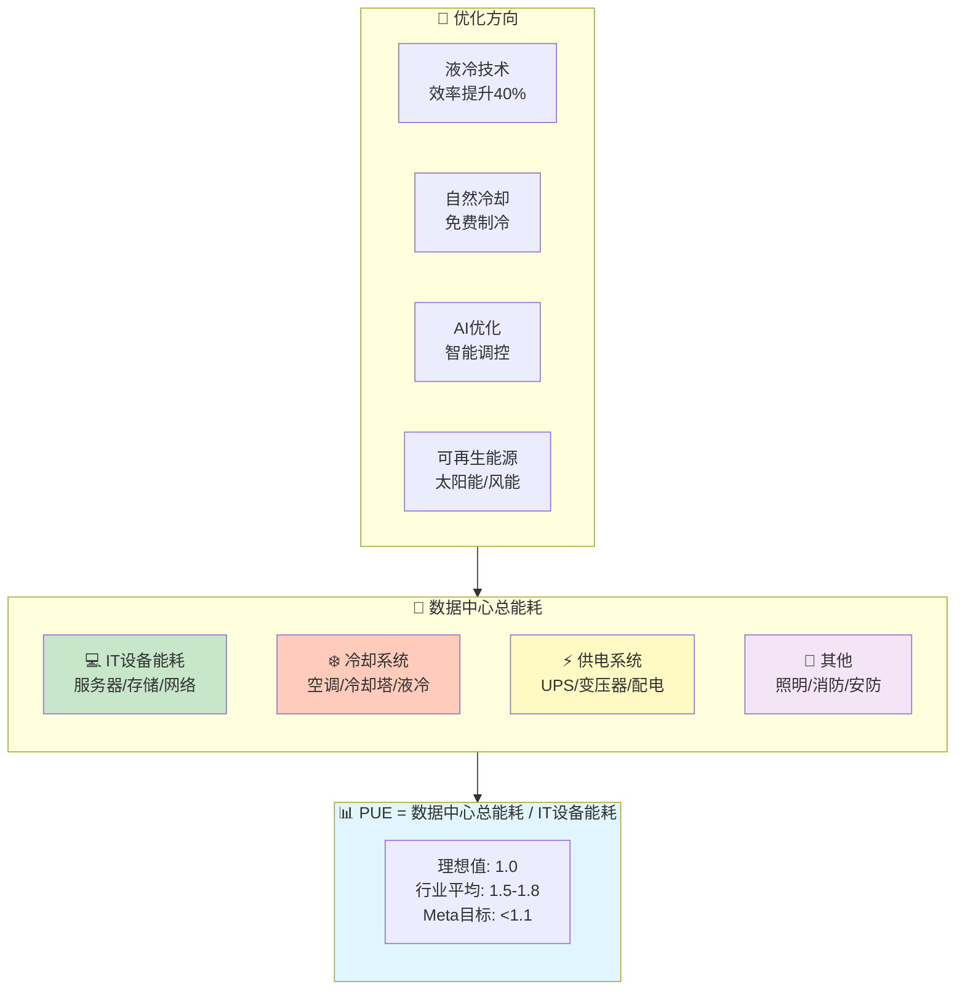
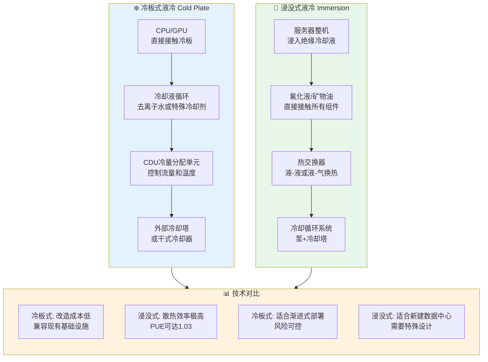
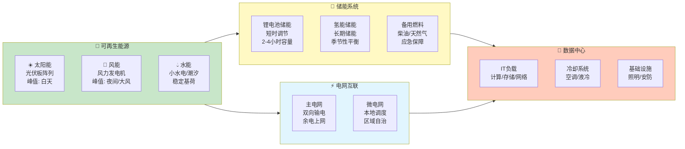
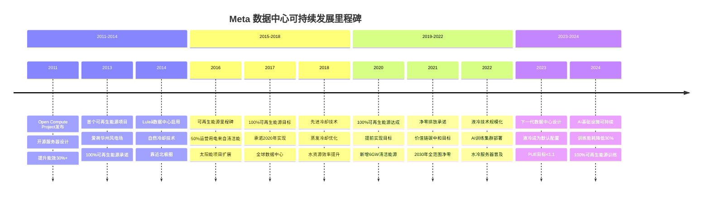

# 第7章 - 绿色计算配图

## 7.1 数据中心PUE优化示意图

### 图片说明
展示PUE（Power Usage Effectiveness，电能使用效率）的计算公式以及数据中心的优化方向，包括供电系统优化、冷却系统优化、IT设备优化等。

### Mermaid图表代码


### LaTeX引用代码
```latex
\begin{figure}[htbp]
    \centering
    \includegraphics[width=0.9\textwidth]{chapter7/pue-optimization.png}
    \caption{数据中心PUE优化示意图。PUE越接近1.0表示能效越高，主要通过优化冷却系统、采用液冷技术、利用自然冷却和可再生能源来实现。}
    \label{fig:pue-optimization}
\end{figure}
```

---

## 7.2 液冷技术架构图

### 图片说明
对比展示冷板式液冷（Cold Plate）与浸没式液冷（Immersion）两种主流液冷技术的架构差异、适用场景和优缺点。

### Mermaid图表代码


### LaTeX引用代码
```latex
\begin{figure}[htbp]
    \centering
    \includegraphics[width=0.95\textwidth]{chapter7/liquid-cooling-architecture.png}
    \caption{液冷技术架构对比图。冷板式液冷适合渐进式部署，浸没式液冷提供最高散热效率但需要专门设计。}
    \label{fig:liquid-cooling}
\end{figure}
```

---

## 7.3 可再生能源应用图

### 图片说明
展示数据中心如何利用太阳能、风能等可再生能源，以及储能系统在保证供电稳定性中的作用。

### Mermaid图表代码


### LaTeX引用代码
```latex
\begin{figure}[htbp]
    \centering
    \includegraphics[width=0.95\textwidth]{chapter7/renewable-energy.png}
    \caption{数据中心可再生能源应用架构。通过多源互补发电、储能缓冲和电网互联，实现高比例可再生能源供电。}
    \label{fig:renewable-energy}
\end{figure}
```

---

## 7.4 Meta可持续发展时间线

### 图片说明
展示Meta（Facebook）从2011年到2024年在数据中心可持续发展方面的重要里程碑和承诺。

### Mermaid图表代码


### LaTeX引用代码
```latex
\begin{figure}[htbp]
    \centering
    \includegraphics[width=0.95\textwidth]{chapter7/meta-sustainability-timeline.png}
    \caption{Meta数据中心可持续发展时间线（2011-2024）。从Open Compute Project到100%可再生能源，再到AI时代的可持续基础设施。}
    \label{fig:meta-timeline}
\end{figure}
```

---

## 本章配图清单

| 序号 | 图号 | 图名 | 文件路径 |
|------|------|------|----------|
| 7.1 | Fig 7.1 | 数据中心PUE优化示意图 | chapter7/pue-optimization.png |
| 7.2 | Fig 7.2 | 液冷技术架构对比图 | chapter7/liquid-cooling-architecture.png |
| 7.3 | Fig 7.3 | 可再生能源应用架构图 | chapter7/renewable-energy.png |
| 7.4 | Fig 7.4 | Meta可持续发展时间线 | chapter7/meta-sustainability-timeline.png |
