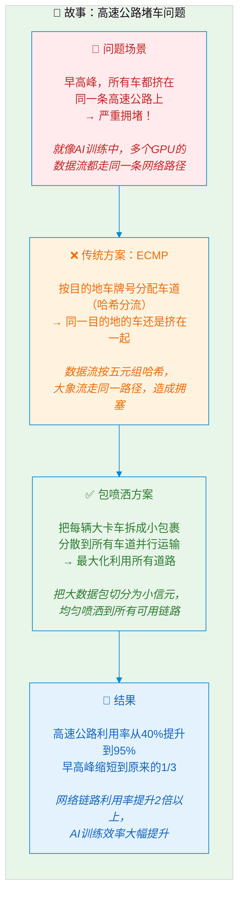
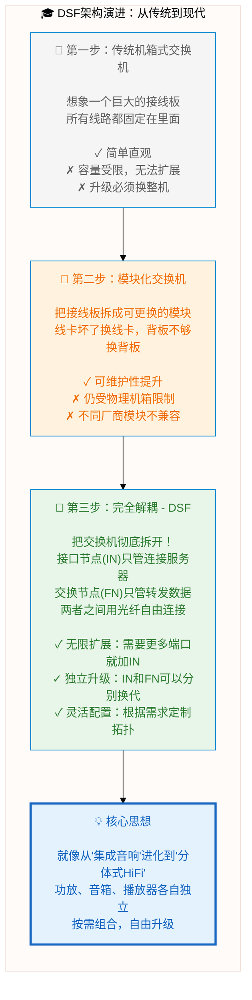
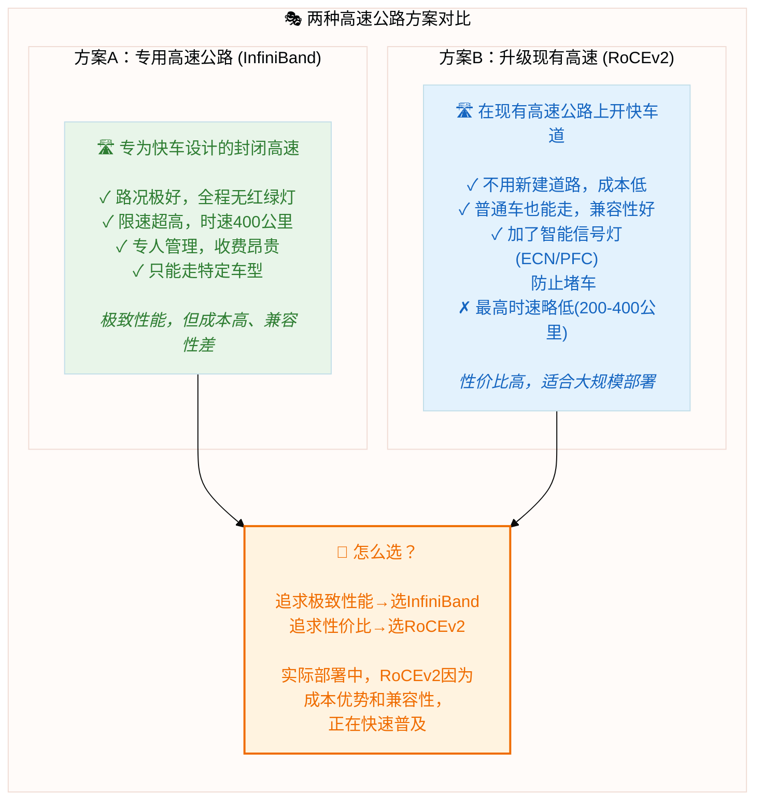
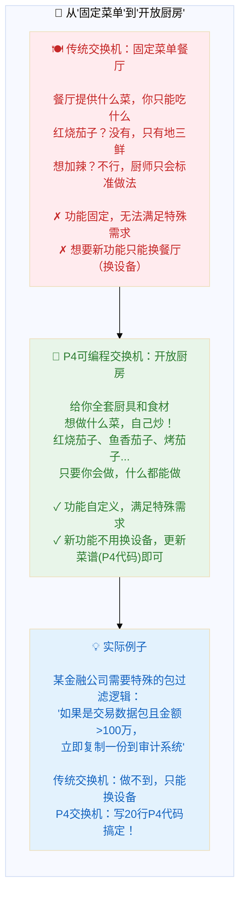

# 教授讲述风格的配图示例

## 风格对比

### ❌ 传统列表式（当前风格）
```
[服务器] → [交换机A] → [交换机B] → [目标]
   ↑            ↑            ↑          ↑
 列表项1      列表项2      列表项3    列表项4
```

### ✅ 教授讲述式（建议风格）
- 循序渐进的故事线
- 类比和生活化比喻
- 从简单到复杂的演进
- 问题和解决方案的对比

---

## 示例1：包喷洒技术（故事化讲述）



**讲述方式**：
> "同学们，想象一下早高峰的高速公路。所有人都挤在几条主干道上，虽然有很多车道，但因为大家都往同一个方向走，还是会堵车。这就是传统的ECMP负载均衡的问题...
>
> 那么包喷洒怎么做呢？它就像把大卡车的货物拆成小包裹，分散到所有车道并行运输。这样无论哪个方向的车多，都能充分利用所有道路...
>
> 结果是，高速公路利用率从40%提升到了95%，早高峰时间缩短到原来的三分之一。在数据中心里，这意味着AI训练速度提升了2倍！"

---

## 示例2：DSF双域架构（渐进式讲解）



**讲述方式**：
> "我们来看DSF的演进过程。最早，交换机就像一个巨大的接线板，所有线路都固定在里面。简单，但容量受限...
>
> 后来出现了模块化设计，就像把接线板拆成可更换的模块。这提升了可维护性，但仍然受限于机箱...
>
> DSF则是彻底解耦——把交换机拆成独立的接口节点和交换节点，用光纤自由连接。这就像从集成音响进化到分体式HiFi...
>
> 结果是：需要更多端口就加接口节点，想升级转发能力就换交换节点，完全按需组合！"

---

## 示例3：RoCEv2 vs InfiniBand（对比故事）



**讲述方式**：
> "如果把网络比作高速公路，InfiniBand就像是专门为赛车修建的封闭赛道——路况极好，速度飞快，但只能走特定车型，而且收费昂贵...
>
> RoCEv2则是在现有高速公路上开通快车道。不用新建道路，普通车也能走，还加了智能信号灯防止堵车。最高速度略低一点，但性价比高得多...
>
> 所以实际部署中，除非是追求极致性能的HPC场景，大多数AI集群都选择了RoCEv2。就像买跑车还是买奔驰，取决于你的预算和需求。"

---

## 示例4：P4可编程网络（类比讲解）



**讲述方式**：
> "理解P4，最好的类比是餐厅。传统交换机就像是固定菜单的餐厅——它提供什么菜，你只能吃什么。想要红烧茄子？抱歉，我们只有地三鲜...
>
> P4可编程交换机就像是开放厨房——给你全套厨具和食材，想做什么菜自己炒！只要你会做，什么都能做...
>
> 实际中，某金融公司有个特殊需求：交易数据包金额超过100万，要立即复制一份到审计系统。传统交换机根本做不到，只能换设备。但用P4交换机，写20行代码就搞定了！"

---

## 建议改进方向

### 1. 每幅图都应有"故事线"
- 问题 → 传统方案 → 新方案 → 结果
- 演进过程：v1 → v2 → v3
- 对比：A vs B

### 2. 多用类比
- 网络问题 → 交通问题
- 数据包 → 快递包裹
- 交换机 → 邮局/餐厅
- 带宽 → 车道数量

### 3. 增加"教授点评"
- 在图旁边添加讲解框
- 解释"为什么这个设计好/不好"
- 联系实际应用场景

### 4. 渐进式复杂度
- 从简单概念开始
- 逐步添加复杂性
- 最后总结核心思想

---

## LaTeX集成建议

```latex
% 教授讲述风格的图片布局
\begin{figure}[htbp]
    \centering
    \includegraphics[width=0.95\textwidth]{chapter3/packet-spraying-story.png}
    \caption{包喷洒技术的故事化讲解。\textbf{教授点评：}"
    就像早高峰的高速公路，把所有车道都利用起来，而不是让某些车道空闲"
    }
    \label{fig:packet-spraying-story}
\end{figure}

% 在正文中延续讲述风格
如图~\ref{fig:packet-spraying-story}所示，我们可以把包喷洒想象成...
```

---

**总结**：教授讲述风格的核心是——
1. 用故事代替列表
2. 用类比解释抽象概念
3. 循序渐进，由浅入深
4. 结合实际问题场景
